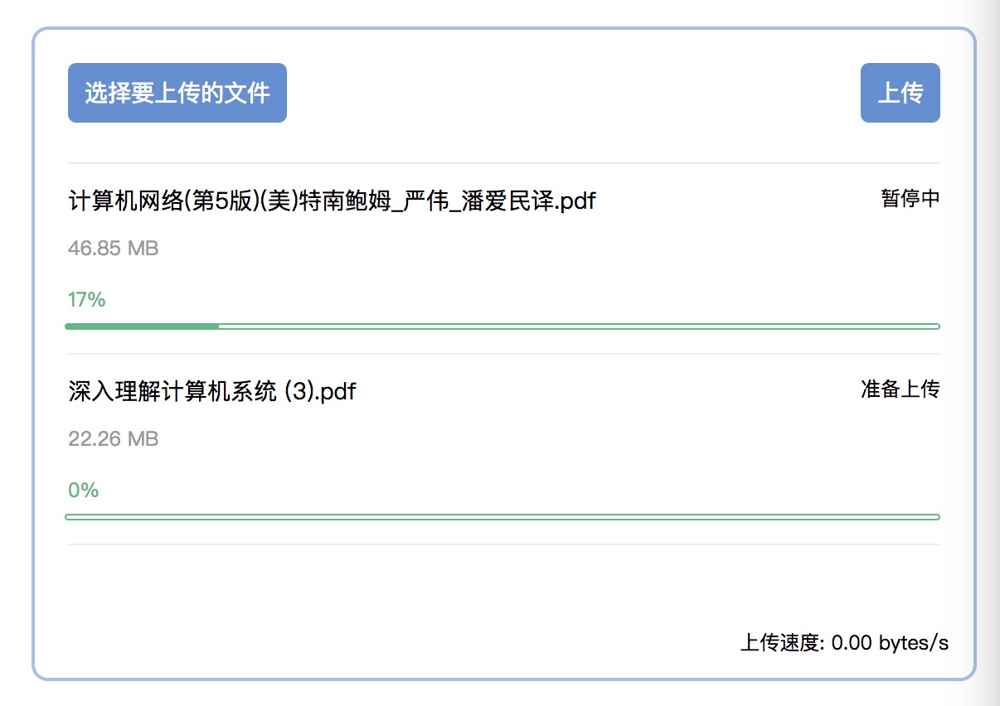

# vue-so-uploader

toy, 基于vue开发的一个上传组件，支持排队上传、分片上传、断点续传。



## How To Use

```
npm install vue-so-uploader
```

```
import soUploader from 'vue-so-uploader'

Vue.use(soUploader)

// template
<soUploader :action="path/to/post/file" :limit="chunkSize"></soUploader>
```

## Props

- `action`: 后台接口，需要包括`GET`、`POST`、`DELETE`.三个动词分别对应请求文件资源信息，上传文件，删除文件。

```
// The request like this:
this.$http
      .get('/path/to/')
      .query({ hash: hashOfFile })
      .then((res) => {
        console.log(res.data) // { size: fileOfSize }
      })
this.$http
      .detele('/path/to/')
      .query({ hash: hashOfFile })
      .then((res) => {
        console.log(res.data) // 'success'
      })
this.$http
      .post('/path/to/')
      .send({ hash: hashOfFile, size: totalSizeOfFile, chunk: filePatialData })
      .then((res) => {
        console.log(res.data) // { size: fileOfSize }
      })
```

- `limit`: 每次分片的大小，单位`bytes`
